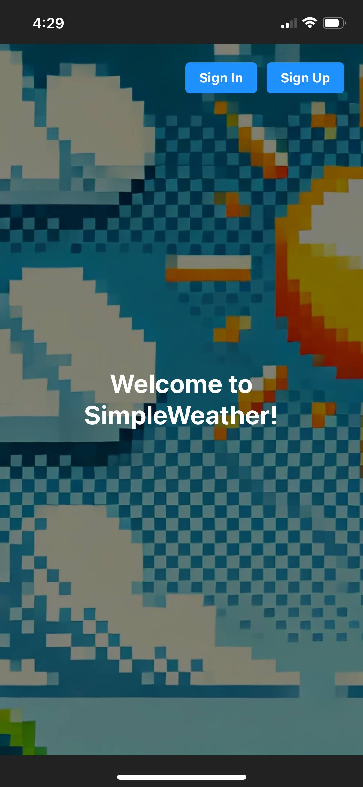

**INTRODUCTION**

### SimpleWeather 🌤️  
A **cross-platform mobile weather app** built using **React Native**. SimpleWeather provides:  

- **Current location weather data**: Get real-time weather updates for your current location.  
- **City weather search**: Look up the weather conditions for any city in the world.  

This app is designed for **Web**, **Android**, and **iOS**, combining modern UI/UX with the power of React Native to deliver a seamless user experience on each.  

Get started today!
---
### Watch the Demo!
[](https://www.youtube.com/shorts/mccBErg2o4k)


---

**FOLDER STRUCTURE**

- `src`: The main directory of the application.

  - `app`: Folder based routing directory.

    - `auth`: Folder for authentication related files.

    - `navigation`: Folder for files handling navigation.

    - `second`: Folder for secondary screen.

    - `services`: Folder for API related services.
  
  - `assets`: Images, fonts, sounds, etc.

  - `components`: Reusable React components.

  - `config`: Shared configuration values.

  - `hooks`: Reusable hooks.

  - `types`: Global and local typings.

  - `utils`: Helpers and reusable methods.

---

**GETTING STARTED**
```bash
# Clone Repo
git clone https://github.com/ThisIsNotJustin/mobile_weather_app.git
```

```bash
# Install most recent version of node (macOS)
brew install node
```

```bash
# Update node to most recent version if already installed (macOS)
brew upgrade node
```

```bash
# Install Expo (macOS with npm)
npm install -g expo-cli
```

```bash
# Install Dependencies
npm run setup
```

```bash
# Start The Dev Server
npm run dev
```

## Setup Environment Variables

Ensure you configure the project with your API keys for OpenWeatherAPI and Firebase.  

Create a '.env' file in the root of the project based on the .env.example as a template.  

---

**LEARN MORE**

[Expo Documentation](https://docs.expo.dev/tutorial/introduction/)

[Expo Router Documentation](https://expo.github.io/router/docs/)

[React Navigation Documentation](https://reactnavigation.org/docs/getting-started)
